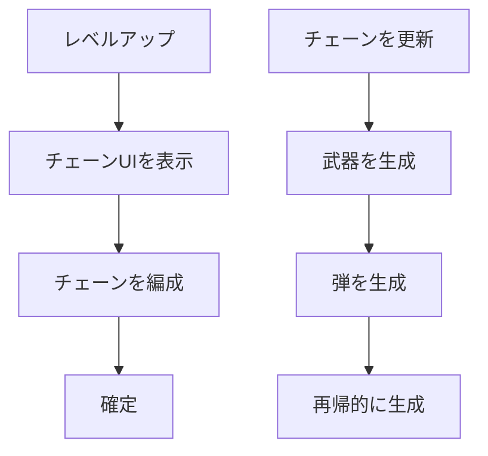
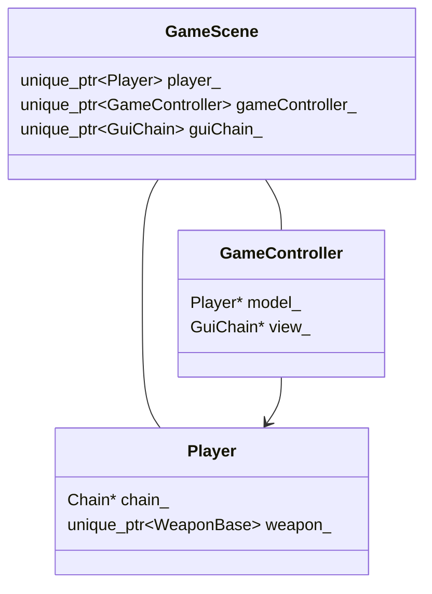
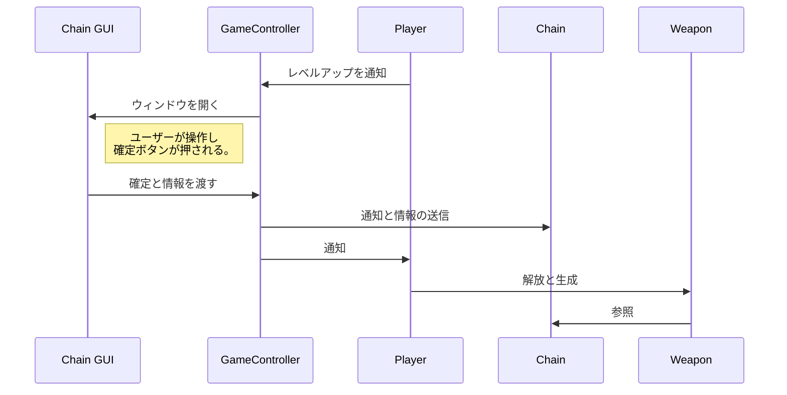

```mermaid
graph TD;
    レベルアップ --> チェーンUIを表示;
    チェーンUIを表示 --> チェーンを編成;
    チェーンを編成 --> 確定;
    チェーンを更新 --> 武器を生成;
    武器を生成 --> 弾を生成;
    弾を生成 --> 再帰的に生成;
```

```mermaid
classDiagram

GameScene--Player
GameScene--GameController
GameController-->Player

class GameScene{
    unique_ptr~Player~ player_
    unique_ptr~GameController~ gameController_
    unique_ptr~GuiChain~ guiChain_
}

class Player{
    Chain* chain_
    unique_ptr~WeaponBase~ weapon_
}

class GameController{
    Player* model_
    GuiChain* view_
}


```

```mermaid
sequenceDiagram
    participant Chain GUI
    participant GameController
    participant Player
    participant Chain
    participant Weapon
    Player->>GameController: レベルアップを通知
    GameController->>Chain GUI: ウィンドウを開く
    Note right of Chain GUI: ユーザーが操作し<br/>確定ボタンが押される。
    Chain GUI->>GameController: 確定と情報を渡す
    GameController->>Chain: 通知と情報の送信
    GameController->>Player: 通知
    Player->>Weapon: 解放と生成
    Weapon->>Chain: 参照
```